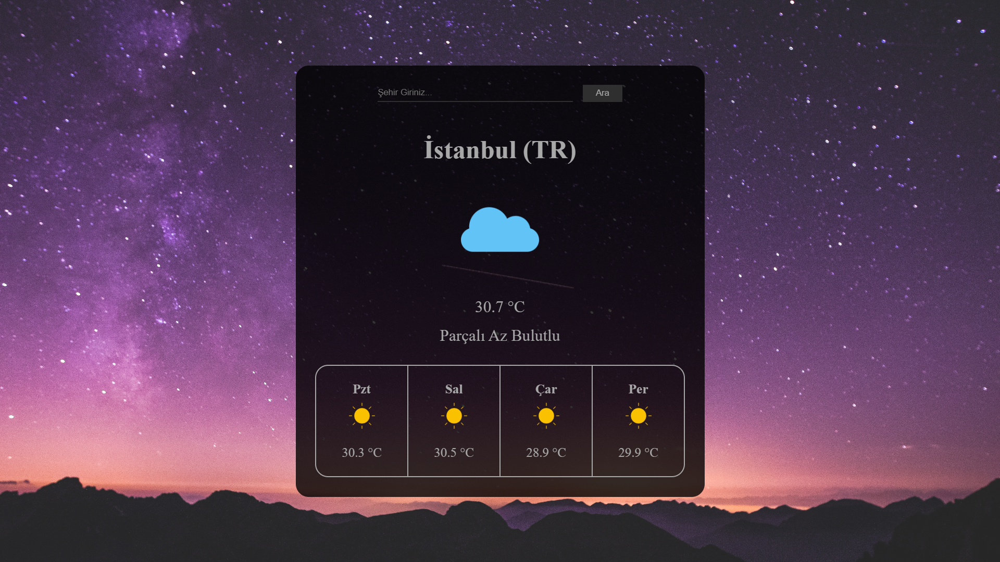
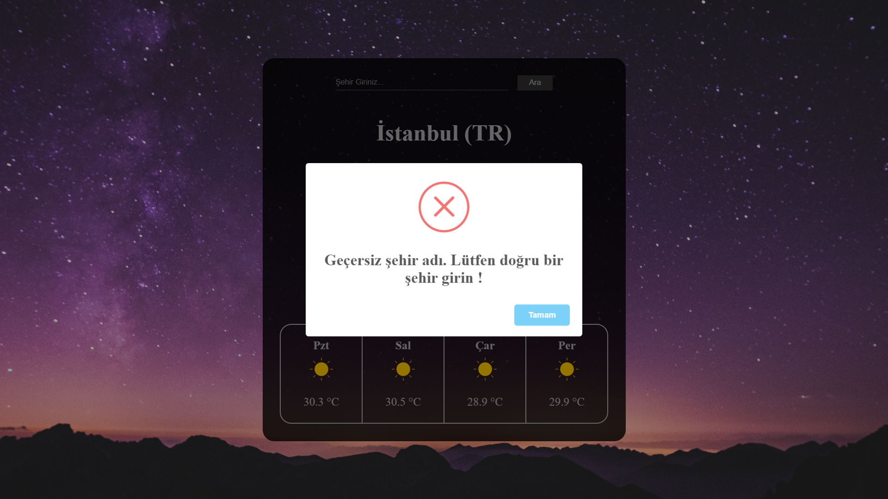
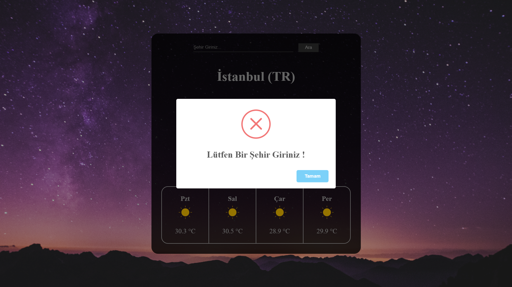
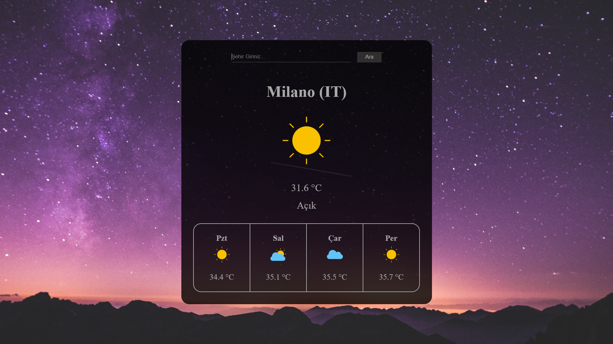

# WeatherApp

React + Vite kullanılarak geliştirilmiş, hava durumu ve 5 günlük tahmin uygulaması.

## 🚀 Özellikler

- Güncel hava durumu gösterimi
- 5 günlük / 3 saatlik tahmin özeti
- Redux Toolkit ile state yönetimi
- OpenWeatherMap API entegrasyonu

## 🛠 Kullanılan Teknolojiler

- React
- Vite
- Redux Toolkit
- Axios
- CSS

## 📦 Kurulum ve Çalıştırma

### 1. Repoyu klonlayın

```bash
git clone https://github.com/muratkaya12/HavaDurumuUygulamasi-WeatherApp.git
```

### 2. Ortam değişkenini ayarlayın

Proje kök dizinine `.env` dosyası ekleyin:

```env
VITE_OPENWEATHER_API_KEY=senin_api_keyin
```

> **Not:** `.env` dosyası `.gitignore` içinde yer aldığından GitHub’a yüklenmez.

### 3. Bağımlılıkları yükleyin

```bash
npm install
```

### 4. Geliştirme sunucusunu başlatın

```bash
npm run dev
```

## 📂 Proje Yapısı (Örnek)

```
WeatherApp/
├─ src/
│  ├─ components/
│  ├─ redux/
│  │  └─ weatherSlice.jsx
│  └─ main.jsx
├─ public/
├─ assets/screenshots/      # Uygulama görselleri
├─ .env                     # API key burada
├─ .gitignore
├─ package.json
└─ README.md
```

---

## 🖼 Ekran Görüntüleri

<p align="center">
  
  
  
  
</p>
